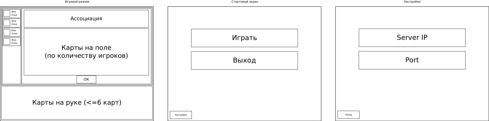
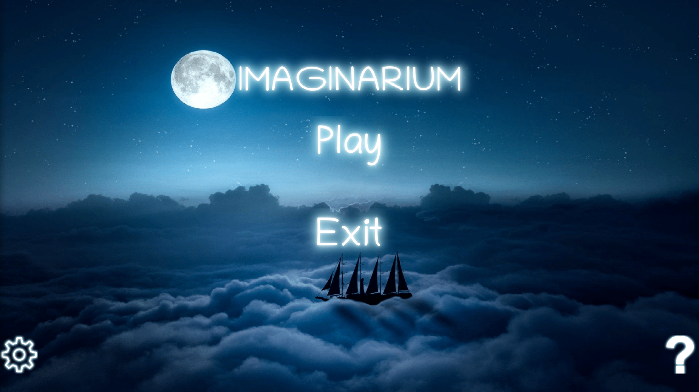

# Imaginarium

-Это птица?

-Это самолет?

-А может это супермэн?

Какую карту загадал ведущий для ассоциации полет? Это и предстоит узнать вам в нашей увликательной игре.

Ваша задача проста: Если ты ведущий, то выбери карту, придумай ассоциацию и смотри, что выберут игроки. Если же ты игрок, то выбери карту, которая больше всего подходят под ассоциацию ведущего, а после среди всех карт, что выложили игроки, найди карту ведущего.

Удачной игры, странник! 

Project description:
Server and client for multiplayer game Imaginarium.
Game rules: https://cdn.mosigra.ru/mosigra.product.other/545/481/imadzhinarium.pdf
  
Interface scetch:

Interface example

